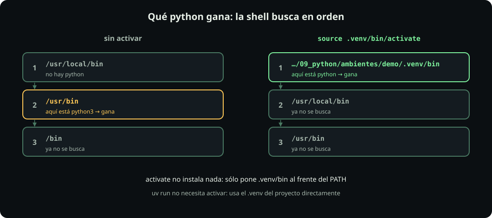

# Un ambiente por dentro

**Página 3 de 10 · Ambientes**

Meta: comprobar con tres comandos qué es un ambiente y qué hace «activar».

::: figure {#py-venv-arbol title="Un ambiente es una carpeta"}

:::

## En corto

- **Un ambiente es una carpeta**, normalmente `.venv/`, dentro de tu proyecto.
- Trae **su propio `python` y su propio `site-packages/`**.
- **Activar sólo cambia el `PATH`**: la lista de carpetas donde la shell busca programas. Con `uv run` no hace falta activar.

## Antes: tu ruta

En los comandos, `{tu_fork_de_la_clase}` es **la carpeta donde clonaste tu fork** del repo del curso: cada quien la tiene en otro lado. Escribe la tuya en lugar del marcador, **sin las llaves**. Si no la recuerdas, abre la terminal de VS Code con tu fork abierto y escribe `pwd` (imprime la carpeta en la que estás).

`$GHUSER` es tu usuario de GitHub, que guardaste en tu shell en la unidad de Git: `echo $GHUSER` te lo muestra: `echo` imprime, y el `$` delante de un nombre lo cambia por el valor guardado en esa variable.

## Prepara un proyecto

**Haz:**

```bash
cd {tu_fork_de_la_clase}/estudiantes/$GHUSER/09_python/ambientes
uv init --no-package hola && cd hola
uv add rich
```

**Qué hace cada pieza:**

- `cd …/ambientes` — entras (`cd`: cambia de carpeta) a tu carpeta de labs, la que copiaste de `codigo/` antes de clase. Ahí están los scripts que usa esta página.
- `uv` — el programa que instala Python y paquetes y arma ambientes; cada palabra después de `uv` es un subcomando: qué le pides.
- `uv init --no-package hola` — `init` inicia un proyecto llamado `hola`: crea la carpeta `hola/` con un proyecto vacío: un `pyproject.toml` (la lista de lo que el proyecto necesita) y un `main.py`. `--no-package` dice que es un proyecto que sólo corre scripts, no una librería para publicar; sin la bandera uv arma además una carpeta `src/` que aquí no usas.
- `&& cd hola` — `&&` encadena: corre lo de la derecha sólo si lo de la izquierda salió bien. Así no entras a una carpeta que no se creó.
- `uv add rich` — agrega el paquete `rich` al proyecto: lo anota en `pyproject.toml`, fija la versión exacta en `uv.lock` y lo instala en un ambiente nuevo, `.venv/`.
- `uv.lock` es el **lockfile**: el archivo con la versión exacta de cada paquete instalado, para que otra máquina instale las mismas.

**Deberías ver:** (las versiones pueden ser más nuevas)

```text
Initialized project `hola` at `…/estudiantes/ana/09_python/ambientes/hola`
Using CPython 3.13.15 interpreter at: /usr/local/bin/python3.13
Creating virtual environment at: .venv
Resolved 5 packages in 455ms
 + markdown-it-py==4.2.0
 + mdurl==0.1.2
 + pygments==2.21.0
 + rich==15.0.0
```

`uv add` creó `.venv/` sin que se lo pidieras. Pediste un paquete e instaló cuatro: `rich` necesita a los otros tres.

## Hechos 1 y 2: una carpeta con su python

**Haz:**

```bash
ls -a .venv
cat .venv/pyvenv.cfg
ls .venv/lib/python3.*/site-packages/ | head
```

**Qué hace cada pieza:**

- `ls -a .venv` — lista todo lo que hay en la carpeta del ambiente, también lo oculto (`-a`: all; en Linux y macOS un nombre que empieza con `.` está oculto).
- `cat .venv/pyvenv.cfg` — muestra el archivo de configuración del ambiente: dice de qué Python salió.
- `python3.*` — el `*` completa cualquier texto: sirve igual si tu Python es 3.12 o 3.13.
- `site-packages/` — la carpeta donde Python busca los paquetes instalados.
- `| head` — el `|` (pipe) manda la salida de un comando a la entrada del siguiente; `head` deja sólo las primeras 10 líneas.

**Deberías ver:**

```text
.  ..  .gitignore  .lock  CACHEDIR.TAG  bin  lib  lib64  pyvenv.cfg

home = /usr/local/bin
implementation = CPython
uv = 0.12.21
version_info = 3.13.15
include-system-site-packages = false

_virtualenv.pth  _virtualenv.py  markdown_it  mdurl  pygments  rich  …
```

- `.` y `..` aparecen en todo `ls -a`: `.` es esta misma carpeta y `..` la de arriba.
- `bin/python` es el intérprete del ambiente: un enlace al Python que dice `home`.
- `site-packages/` tiene **sólo** lo que instalaste aquí: `rich` y sus tres dependencias.
- `include-system-site-packages = false`: este ambiente no ve los paquetes del sistema.
- `lib64` sólo aparece en Linux; en macOS no está.

## Hecho 3: activar cambia el PATH

::: figure {#py-path title="Qué python gana: la shell busca en orden"}

:::

**Haz:** corre `quien_soy.py` de tres maneras.

```bash
cp ../quien_soy.py .
python3 quien_soy.py              # 1. sin activar
source .venv/bin/activate
python quien_soy.py               # 2. activado
deactivate
uv run quien_soy.py               # 3. sin activar, con uv run
```

**Qué hace cada pieza:**

- `cp ../quien_soy.py .` — copia el script de diagnóstico de la carpeta de arriba (`..`) a ésta (`.`).
- `quien_soy.py` — script del curso que imprime qué python corre y si tiene `rich`. Sirve para comparar las tres maneras.
- `# 1. sin activar` — lo que sigue a `#` es comentario: la shell lo ignora.
- `python3 quien_soy.py` — lo corre con el `python3` que tu shell encuentre primero. Sin activar se escribe `python3`: en muchos Linux no existe un comando `python` a secas.
- `source .venv/bin/activate` — **activa** el ambiente: tu prompt empieza con `(hola)`. `source` corre el archivo dentro de tu shell actual; por eso puede cambiarle el `PATH`.
- `python quien_soy.py` — activado, `.venv/bin/` trae `python` y `python3`; los dos son el del ambiente.
- `deactivate` — lo desactiva: tu shell vuelve a como estaba.
- `uv run quien_soy.py` — lo corre con el python del `.venv/` del proyecto, sin activar nada: uv busca el `.venv/` junto al `pyproject.toml`.

**Deberías ver:** cambian cuatro líneas.

| Línea | 1. sin activar | 2. activado | 3. `uv run` |
|---|---|---|---|
| `python que corre` | `/usr/local/bin/python3` | `…/hola/.venv/bin/python` | `…/hola/.venv/bin/python` |
| `sys.prefix` | `/usr/local` | `…/hola/.venv` | `…/hola/.venv` |
| `¿en un ambiente?` | `no` | `sí` | `sí` |
| `rich` | `NO instalado en este Python` | `instalado, versión 15.0.0` | `instalado, versión 15.0.0` |

La columna 1 es la del Python de tu sistema: en tu máquina puede decir `/usr/bin/python3` o `/opt/homebrew/bin/python3`. Lo que importa es que **no** es `.venv`.

## Lo que de verdad hace activate

**Haz:**

```bash
echo $PATH | tr ':' '\n' | head -2
source .venv/bin/activate
echo $PATH | tr ':' '\n' | head -2
deactivate
```

**Qué hace cada pieza:**

- `echo $PATH` — imprime la lista de carpetas donde la shell busca programas, separadas por `:`. Cuando escribes `python`, la shell usa el primero que encuentre recorriéndolas en orden.
- `| tr ':' '\n'` — `tr` (translate) cambia cada `:` por `\n`, un salto de línea: una carpeta por renglón. Las comillas evitan que la shell interprete esos caracteres.
- `| head -2` — deja sólo las dos primeras, las que se revisan antes.

**Deberías ver:** la primera carpeta cambia.

```text
/usr/local/bin
/usr/local/sbin
…/estudiantes/ana/09_python/ambientes/hola/.venv/bin
/usr/local/bin
```

- `activate` **no instala ni copia nada**: sólo cambia en qué orden la shell busca `python`.
- `uv run` usa el `.venv/` del proyecto **sin tocar tu shell**. Por eso en este curso no hace falta activar.

::: problem {#py-activado title="¿Dónde quedó rich?"}
Abres una terminal nueva, entras a `estudiantes/<tu-login>/09_python/ambientes/hola` y corres `python hola.py`. Sale `ModuleNotFoundError: No module named 'rich'`. Ayer funcionaba. ¿Qué pasó?
:::

::: hint {of="py-activado"}
¿Qué te diría `quien_soy.py` en esa terminal nueva?
:::

::: answer {of="py-activado"}
- La terminal nueva no está activada: `python` es el del sistema, que no tiene `rich`.
- `rich` sigue en `.venv/`; no se borró nada.
- Arreglo: `uv run hola.py`, o activar primero.
:::

Sigue con [[los-archivos-del-ambiente]]: qué archivos describen un ambiente y cuáles van a git.

> [!NOTE]
> **Si sólo recuerdas una cosa:** un ambiente es una carpeta con su propio python; activar sólo cambia cuál python encuentra tu shell.
