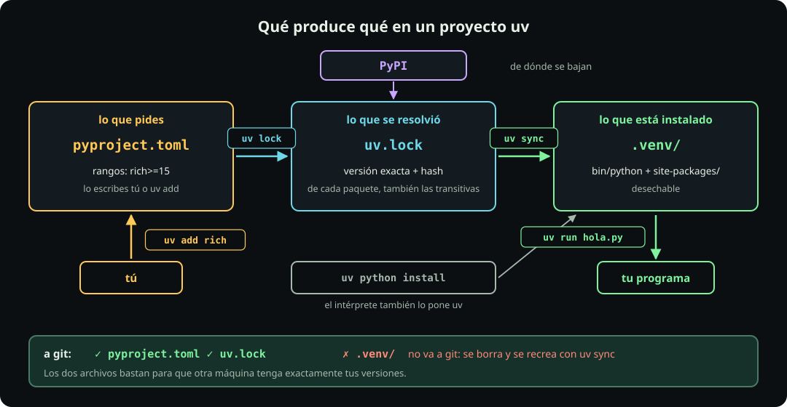

# Lab: uv de punta a punta

**Página 7 de 10 · Ambientes**

Meta: crear, usar, romper y recrear un proyecto uv, y ver en cada paso qué archivo cambió.



## En corto

- **`uv add` escribe `pyproject.toml`, resuelve `uv.lock` e instala en `.venv/`**, todo en un comando.
- **`uv run` nunca necesita activar**, y si falta `.venv/` lo recrea desde el lock.
- A git van `pyproject.toml` y `uv.lock`; `.venv/` se tira y se recrea.

## Antes: tu uv

**Haz:**

```bash
uv self update
uv --version
```

**Qué hace cada pieza:**

- `uv self update` — actualiza uv a su última versión (`self`: el subcomando que actúa sobre uv mismo). Las banderas y salidas cambian entre versiones; así ves lo mismo que esta página.
- `uv --version` — imprime la versión que quedó.

**Deberías ver:** `uv 0.12.21` o más nuevo. Las salidas de esta página se capturaron con **uv 0.12.21** y Python 3.13.15; tus números de versión pueden ser mayores. Si instalaste uv con otro gestor (Homebrew, pipx), `uv self update` te lo dice: actualiza con ese gestor.

### 1. El intérprete

**Haz:**

```bash
uv python install 3.13
```

**Qué hace cada pieza:**

- `uv python install 3.13` — baja e instala Python 3.13 en una carpeta de uv (`~/.local/share/uv/python/`). No toca el Python de tu sistema.
- Por qué: así todos usan la misma versión de Python, sin importar cuál traiga tu sistema.

**Deberías ver:**

```text
Installed Python 3.13.15 in 1.99s
 + cpython-3.13.15-linux-x86_64-gnu (python3.13)
```

**En el mapa:** uv pone el Python. No necesitas el del sistema, ni instalarlo aparte.

### 2. Un proyecto

**Haz:**

```bash
cd {tu_fork_de_la_clase}/estudiantes/$GHUSER/09_python/ambientes
uv init --no-package demo && cd demo
ls -a && cat pyproject.toml
```

**Qué hace cada pieza:**

- `cd …/ambientes` — entras a tu carpeta de labs. `{tu_fork_de_la_clase}` es donde clonaste tu fork: pon la tuya, sin llaves.
- `uv init --no-package demo` — `init` inicia un proyecto llamado `demo`: crea la carpeta `demo/` con `pyproject.toml` (lo que el proyecto necesita), `main.py`, `README.md` y `.python-version` (qué versión de Python usa).
- `--no-package` — el proyecto sólo corre scripts; no es una librería para publicar.
- `&&` — corre lo de la derecha sólo si lo de la izquierda salió bien: no entras a una carpeta que no se creó.
- `ls -a && cat pyproject.toml` — lista lo que se creó, también lo oculto (`-a`), y muestra el `pyproject.toml` (`cat`). En la salida, `.` es esta carpeta y `..` la de arriba.

**Deberías ver:**

```text
.  ..  .python-version  README.md  main.py  pyproject.toml
[project]
name = "demo"
version = "0.1.0"
description = "Add your description here"
readme = "README.md"
requires-python = ">=3.13"
dependencies = []
```

**En el mapa:** existe `pyproject.toml`; todavía no hay `uv.lock` ni `.venv/`. Sin `--no-package`, uv 0.12 arma un paquete instalable con carpeta `src/`.

### 3. Un paquete

**Haz:**

```bash
uv add rich
ls -a && grep -A2 dependencies pyproject.toml
```

**Qué hace cada pieza:**

- `uv add rich` — agrega `rich`: lo anota en `pyproject.toml`, **resuelve** (escoge una versión de cada paquete compatible con todos los demás), fija esas versiones exactas en `uv.lock` y las instala en `.venv/` (si no existe, lo crea).
- `uv.lock` — el **lockfile**: el archivo con la versión exacta de cada paquete, para que otra máquina instale las mismas.
- `grep -A2 dependencies pyproject.toml` — `grep` imprime las líneas del archivo que contienen `dependencies`; `-A2` (after) agrega las dos siguientes.

**Deberías ver:** (recortado)

```text
 + rich==15.0.0
.  ..  .python-version  .venv  README.md  main.py  pyproject.toml  uv.lock
dependencies = [
    "rich>=15.0.0",
]
```

**En el mapa:** un comando tocó las tres cajas. `pyproject.toml` ganó un **rango** (`>=15.0.0`: la 15.0.0 o una más nueva); `uv.lock` y `.venv/` nacieron.

### 4. Correr

**Haz:**

```bash
cp ../hola.py .
uv run hola.py
```

**Qué hace cada pieza:**

- `cp ../hola.py .` — copia (`cp`) `hola.py` de la carpeta de arriba (`..`) a ésta (`.`).
- `uv run hola.py` — lo corre con el python de `.venv/`, sin activar. Si el ambiente no coincide con el lock, primero lo pone al día.

**Deberías ver:** `Hola desde un Python que sí tiene rich instalado.`, con colores.

**En el mapa:** `uv run` usó `.venv/` sin activar nada.

### 5. Leer el lock

**Haz:**

```bash
grep -c '^\[\[package\]\]' uv.lock
uv tree
```

**Qué hace cada pieza:**

- `grep -c '^\[\[package\]\]' uv.lock` — cuenta (`-c`: count) cuántos paquetes fija el lock: cada uno empieza con `[[package]]`.
- En el patrón, `^` es «al inicio de la línea» y `\[` es un corchete literal (`[` a secas es especial para `grep`). Las comillas simples evitan que la shell toque el patrón.
- `uv tree` — dibuja, a partir del lock, quién necesita a quién.

**Deberías ver:**

```text
5
demo v0.1.0
└── rich v15.0.0
    ├── markdown-it-py v4.2.0
    │   └── mdurl v0.1.2
    └── pygments v2.21.0
```

**En el mapa:** pediste un paquete y el lock fija cinco entradas: tu proyecto, `rich` y tres **transitivas**: no las pediste tú, las pide `rich`. Cada una con versión exacta y **hash**: una huella del archivo descargado; si el archivo cambia, el hash no coincide y uv se niega a instalarlo.

### 6. Romperlo

**Haz:**

```bash
rm -rf .venv
uv run hola.py
```

**Qué hace cada pieza:**

- `rm -rf .venv` — borra la carpeta del ambiente completa (`-r`: con todo lo de adentro; `-f`: sin preguntar).
- `uv run hola.py` — al no encontrar `.venv/`, uv lo recrea desde `uv.lock` y luego corre el script.
- Por qué: para comprobar que `.venv/` se puede tirar sin perder nada.

**Deberías ver:**

```text
Creating virtual environment at: .venv
Installed 4 packages in 12ms
Hola desde un Python que sí tiene rich instalado.
```

**En el mapa:** `.venv/` se recreó desde `uv.lock`, con las mismas versiones. Por eso `.venv/` no va a git: se recrea en segundos.

### 7. Dependencias de desarrollo

**Haz:**

```bash
uv add --dev pytest
tail -4 pyproject.toml
```

**Qué hace cada pieza:**

- `uv add --dev pytest` — agrega `pytest` como dependencia **de desarrollo** (`--dev`): la usas tú, no tu programa.
- `tail -4 pyproject.toml` — muestra las últimas 4 líneas del archivo (`tail`: el final; `head`: el principio).
- `[dependency-groups]` — la sección de `pyproject.toml` para dependencias que no viajan con el programa; `--dev` llena el grupo `dev`.

**Deberías ver:**

```text
[dependency-groups]
dev = [
    "pytest>=9.1.1",
]
```

**En el mapa:** `pytest` lo necesitas tú para probar, no el programa para correr. Va en otro grupo.

### 8. Quitar

**Haz:**

```bash
uv remove rich
uv run hola.py
```

**Qué hace cada pieza:**

- `uv remove rich` — lo quita de `pyproject.toml`, de `uv.lock` y de `.venv/`.
- `uv run hola.py` — lo intentas correr sin `rich`, para comprobar que de verdad se fue.

**Deberías ver:**

```text
 - rich==15.0.0
ModuleNotFoundError: No module named 'rich'
```

**En el mapa:** se fue de las tres cajas. Vuelve a ponerlo: `uv add rich`.

### 9. Una herramienta sin instalarla

**Haz:**

```bash
uvx cowsay -t hola
```

**Qué hace cada pieza:**

- `uvx cowsay` — corre el programa `cowsay` (una vaca en ASCII que repite un texto) sin instalarlo en tu proyecto: uv lo baja a un ambiente temporal. `uvx` es la forma corta de `uv tool run`.
- `-t hola` — bandera de `cowsay`, no de uv: lo que va después del nombre del programa es para el programa. `-t` es el texto que dice la vaca.
- Por qué: herramientas que usas de vez en cuando (un formateador, un linter) no tienen por qué entrar en `pyproject.toml`.

**Deberías ver:** una vaca que dice `hola`.

**En el mapa:** ninguna caja cambió. `uvx` corre un programa en un ambiente temporal, fuera de tu proyecto.

### 10. Un script con sus dependencias dentro

**Haz:**

```bash
cd ..
head -4 script_autonomo.py
uv run script_autonomo.py
```

**Qué hace cada pieza:**

- `cd ..` — subes a `ambientes/`, donde está `script_autonomo.py`.
- `head -4 script_autonomo.py` — muestra sus primeras 4 líneas: el bloque `# /// script`.
- `uv run script_autonomo.py` — uv lee ese bloque, arma un ambiente temporal con `rich` en su caché (`~/.cache/uv/`) y corre el script.

**Deberías ver:** el bloque `# /// script` con `dependencies = ["rich"]`, y una tabla cuya fila «Ambiente» apunta a `~/.cache/uv/environments-v2/…`.

**En el mapa:** el bloque del archivo cumple el papel de `pyproject.toml`. Lo define el PEP 723, el estándar de Python para declarar dependencias dentro de un script. Sirve para scripts sueltos: no hay proyecto ni `.venv/` en tu carpeta.

## Puente al mundo de pip

| Comando | Para qué |
|---|---|
| `uv pip install rich` | La interfaz de pip, más rápida, sobre el ambiente activo o `.venv/` |
| `uv export --no-hashes --no-dev > requirements.txt` | Para quien sólo tiene pip; `--no-dev` deja fuera `pytest` y lo demás de desarrollo |

- `uv pip install` — uv con los mismos comandos que `pip`; no toca `pyproject.toml` ni `uv.lock`.
- `uv export` — escribe el contenido de `uv.lock` en el formato de `requirements.txt`: la lista de paquetes que lee `pip install -r`.
- `--no-hashes` — omite los hashes: el archivo queda legible y `pip` no exige verificar cada paquete.
- `--no-dev` — deja fuera el grupo `dev`.
- `> requirements.txt` — `>` manda la salida a ese archivo en vez de a la pantalla; si ya existía, lo sobrescribe.

La salida (recortada) lista cada paquete con su versión exacta y, debajo, quién lo pidió:

```text
markdown-it-py==4.2.0
    # via rich
rich==15.0.0
    # via demo
```

## Qué subes a git

| Archivo | ¿A git? | Por qué |
|---|---|---|
| `pyproject.toml` | ✅ | Lo que pides |
| `uv.lock` | ✅ | Las versiones exactas: sin él, otra máquina resuelve otras |
| `.python-version` | ✅ | Qué Python usa el proyecto |
| `.venv/` | ❌ | Se recrea con `uv sync`; el `.gitignore` del curso lo excluye y la revisión de entregas lo rechaza |

- `uv sync` — deja `.venv/` idéntico a `uv.lock`: instala lo que falta y quita lo que sobra. Si no hay `uv.lock`, primero lo resuelve.
- `.gitignore` — la lista de archivos que git no sube.

::: problem {#py-lab-uv-clon title="Lo clonaste en otra máquina"}
Tu compañero clona tu repo: trae `pyproject.toml` y `uv.lock`, sin `.venv/`. ¿Qué comando corre para tener exactamente tus versiones, y por qué no `uv add rich`?
:::

::: hint {of="py-lab-uv-clon"}
¿Cuál de los dos archivos tiene las versiones exactas?
:::

::: answer {of="py-lab-uv-clon"}
- `uv sync`, o directo `uv run hola.py`: instalan lo que dice `uv.lock`.
- `uv add rich` volvería a resolver y podría escoger una versión más nueva que la tuya.
:::

Sigue con [[lab-venv-y-pip]]: la forma clásica, para reconocerla en un README.

> [!NOTE]
> **Si sólo recuerdas una cosa:** pyproject.toml dice lo que pides, uv.lock lo que exactamente se instaló, y .venv/ se tira y se recrea con uv sync.
