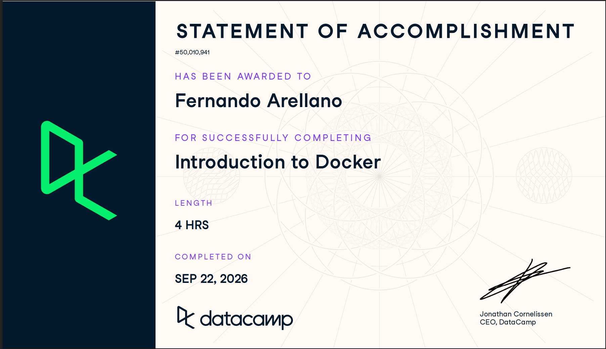
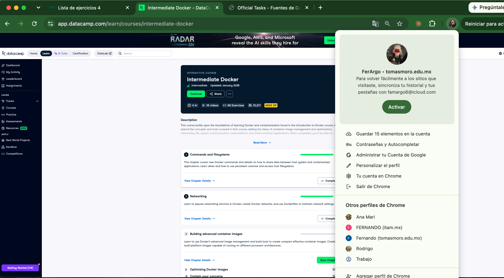
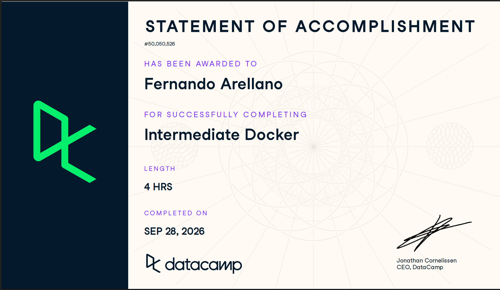

# Certificaciones de Docker

Llena este archivo en **tu copia**, dentro de `estudiantes/<tu-login>/docker/`.

Son **dos** cursos de Docker en DataCamp, no tres. El segundo se entrega en dos
partes, por eso hay tres secciones.

## Quién soy

- Nombre: Fernando Arellano González
- Usuario de GitHub: FerArGo56
- Correo con el que entraste a DataCamp: farell13@itam.mx

## Introduction to Docker

Se llena en la **primera** entrega.

Fecha en que lo terminaste: 22 de septiembre de 2026

URL del Statement of Accomplishment: https://www.datacamp.com/completed/statement-of-accomplishment/course/95bbf596df8374801db6b00c4d6aca61b9834fd2

## Intermediate Docker · capítulos 1 y 2

Se llena en la **segunda** entrega. El curso no está terminado todavía, así que
**no hay certificado**: la captura que sirve es la página del curso con sus
cuatro capítulos, donde se vean los dos primeros al 100 % y tu nombre.

Fecha:24 de septiembre de 2026

## Intermediate Docker · capítulos 3 y 4

Se llena en la **tercera** entrega, cuando el curso ya está completo.

Fecha:28 de septiembre de 2026

URL del Statement of Accomplishment:https://www.datacamp.com/completed/statement-of-accomplishment/course/75a98a32e24257cc2fbfcf0a4e23b4f37f36288c?utm_medium=organic_social&utm_campaign=sharewidget&utm_content=soa

## Una cosa que aprendiste y no sabías
Despues de los cursos aprendi sobre el Multi-Stage build y sobre los composes
aun que la verdad voy a tenerlo que repasar un poco por que esta algo 
complicado, lo que se afianzo de la clase fue mas que nada todo sobre lo de 
volumenes.

Se llena en la **tercera** entrega. Dos o tres líneas. Algo concreto de alguno
de los dos cursos que no habías visto en clase, o que en clase entendiste a
medias y ahí se te acomodó.
