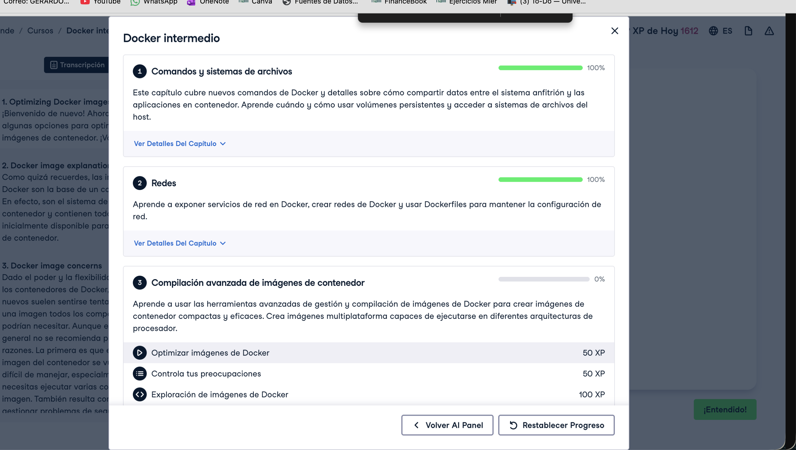
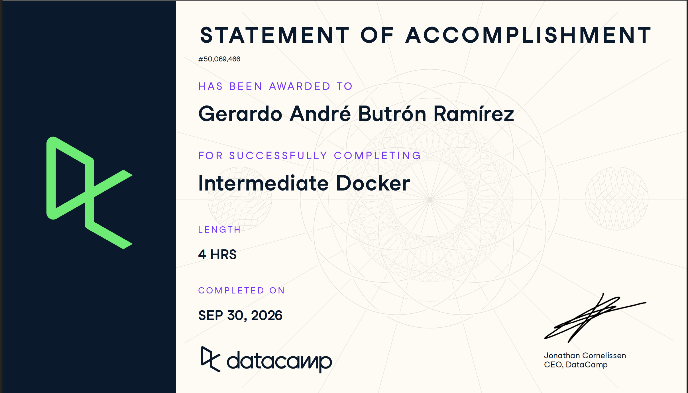

# Certificaciones de Docker

Llena este archivo en **tu copia**, dentro de `estudiantes/<tu-login>/docker/`.

Son **dos** cursos de Docker en DataCamp, no tres. El segundo se entrega en dos
partes, por eso hay tres secciones.

## Quién soy

- Nombre: Gerardo André Butrón Ramírez
- Usuario de GitHub: butronand-png
- Correo con el que entraste a DataCamp: gerardo.butron@itam.mx

## Introduction to Docker

Se llena en la **primera** entrega.

Fecha en que lo terminaste: 22 de septiembre de 2026

URL del Statement of Accomplishment: https://www.datacamp.com/completed/statement-of-accomplishment/course/9515d9e4e67654c9fc139a1d1030b211c8200a0e

## Intermediate Docker · capítulos 1 y 2

Se llena en la **segunda** entrega. El curso no está terminado todavía, así que
**no hay certificado**: la captura que sirve es la página del curso con sus
cuatro capítulos, donde se vean los dos primeros al 100 % y tu nombre.

Fecha: 24 de septiembre de 2026

## Intermediate Docker · capítulos 3 y 4

Se llena en la **tercera** entrega, cuando el curso ya está completo.

Fecha: 29 de septiembre de 2026

> El Statement dice 30 de septiembre porque DataCamp usa hora UTC; lo terminé el 29 en hora de CDMX.

URL del Statement of Accomplishment: https://www.datacamp.com/statement-of-accomplishment/course/f5055ca5f9d5afd830d3619c530d19c3a45eb168?raw=1

## Una cosa que aprendiste y no sabías

Se llena en la **tercera** entrega. Dos o tres líneas. Algo concreto de alguno
de los dos cursos que no habías visto en clase, o que en clase entendiste a
medias y ahí se te acomodó.

Entendí mejor la diferencia entre una imagen y un volumen: la imagen es la plantilla
de solo lectura y el volumen es donde viven los datos que deben sobrevivir cuando
borro el contenedor. También vi con más detalle cómo el orden de las instrucciones
en un Dockerfile afecta el caché de capas, y reforcé los comandos más comunes de Docker.