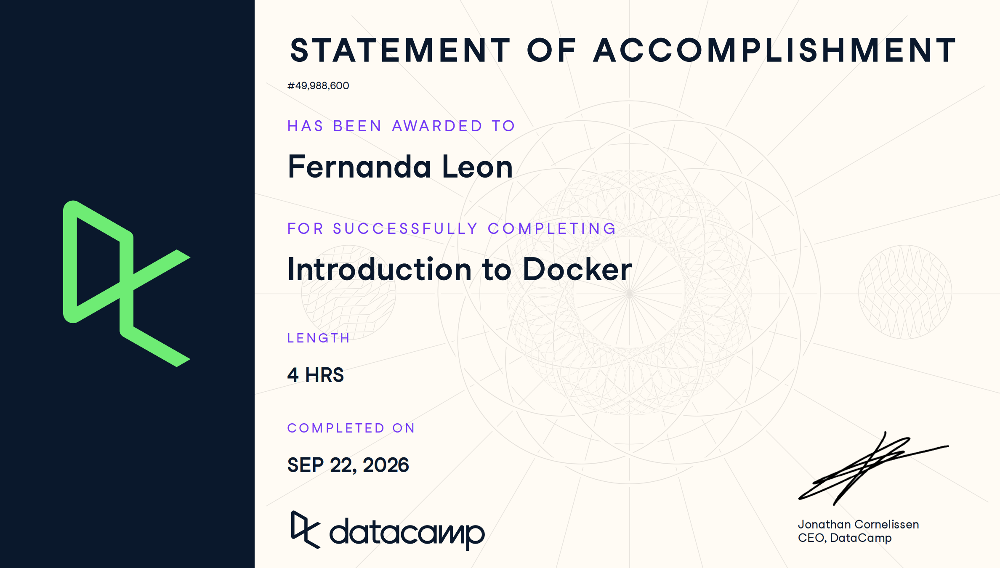
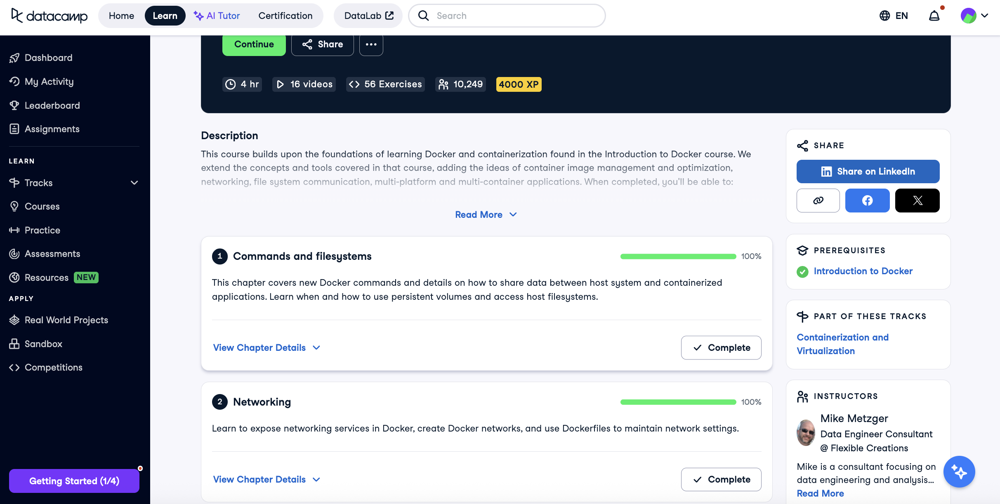
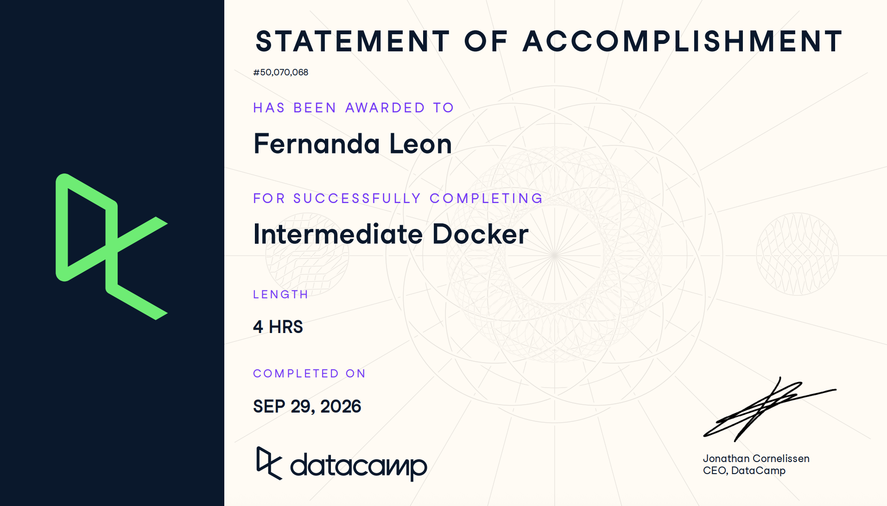

# Certificaciones de Docker

Llena este archivo en **tu copia**, dentro de `estudiantes/<tu-login>/docker/`.

Son **dos** cursos de Docker en DataCamp, no tres. El segundo se entrega en dos
partes, por eso hay tres secciones.

## Quién soy

- Nombre: María Fernanda León Hernández
- Usuario de GitHub: fernandalh25
- Correo con el que entraste a DataCamp: mleonhe1@itam.mx

## Introduction to Docker

Se llena en la **primera** entrega.

Fecha en que lo terminaste: 22 de septiembre de 2026

URL del Statement of Accomplishment: https://www.datacamp.com/completed/statement-of-accomplishment/course/b38fbaf30f9a6b1886070ad33ea6957fcef52a36

## Intermediate Docker · capítulos 1 y 2

Se llena en la **segunda** entrega. El curso no está terminado todavía, así que
**no hay certificado**: la captura que sirve es la página del curso con sus
cuatro capítulos, donde se vean los dos primeros al 100 % y tu nombre.

Fecha: 29 septiembre 2026

## Intermediate Docker · capítulos 3 y 4

Se llena en la **tercera** entrega, cuando el curso ya está completo.

Fecha: 29 septiembre 2026

URL del Statement of Accomplishment: https://www.datacamp.com/completed/statement-of-accomplishment/course/b7d602d78f071f12e395bbb200a18b78d9628d4b?utm_medium=organic_social&utm_campaign=sharewidget&utm_content=soa

## Una cosa que aprendiste y no sabías
Algo que no tenía tan claro antes de los cursos era cómo funciona Docker Compose para administrar varios contenedores como parte de una misma aplicación. Me ayudó a entender mejor cómo se conectan los servicios mediante redes y cómo se pueden compartir datos utilizando volúmenes.

Se llena en la **tercera** entrega. Dos o tres líneas. Algo concreto de alguno
de los dos cursos que no habías visto en clase, o que en clase entendiste a
medias y ahí se te acomodó.
