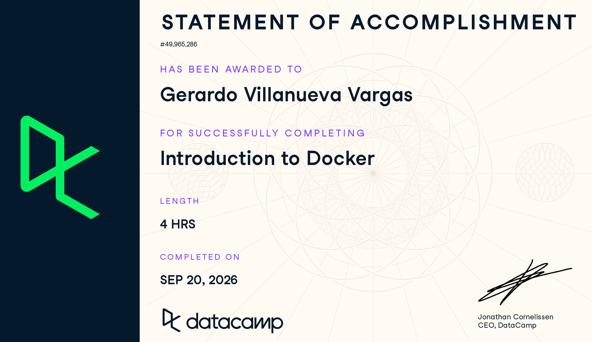
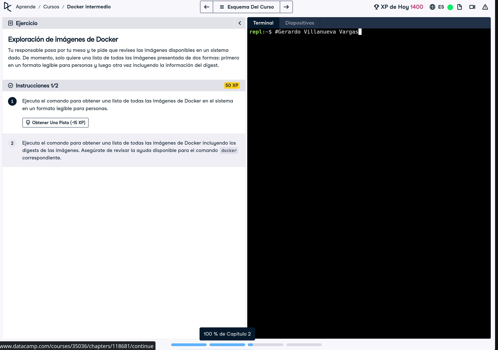
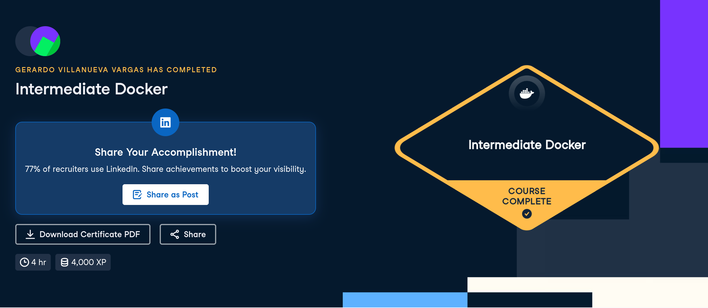

# Certificaciones de Docker

Llena este archivo en **tu copia**, dentro de `estudiantes/<tu-login>/docker/`.

Son **dos** cursos de Docker en DataCamp, no tres. El segundo se entrega en dos
partes, por eso hay tres secciones.

## Quién soy

- Nombre: Gerardo Villanueva Vargas
- Usuario de GitHub: geraVillV
- Correo con el que entraste a DataCamp: gvillan7@itam.mx

## Introduction to Docker

Se llena en la **primera** entrega.

Fecha en que lo terminaste: 20 de Septiembre, 2026

URL del Statement of Accomplishment: https://www.datacamp.com/completed/statement-of-accomplishment/course/ccc4c1ead1f4ff5c5074a617c01e7916c8e57bf3?utm_medium=organic_social&utm_campaign=sharewidget&utm_content=soa

## Intermediate Docker · capítulos 1 y 2

Fecha:24 de Septiembre de 2026.

## Intermediate Docker · capítulos 3 y 4

Fecha:26 de septiembre de 2026.

URL del Statement of Accomplishment: https://www.datacamp.com/completed/statement-of-accomplishment/course/6678d1404e9999d7d6bbecda4e73287ea772fd52

## Una cosa que aprendiste y no sabías

No había pensado en cómo Docker Compose permite definir y levantar varios
servicios que se comunican entre sí desde un solo archivo. También entendí
mejor el papel de los puertos y de las dependencias entre servicios al trabajar
con el ejercicio final de una aplicación completa.
