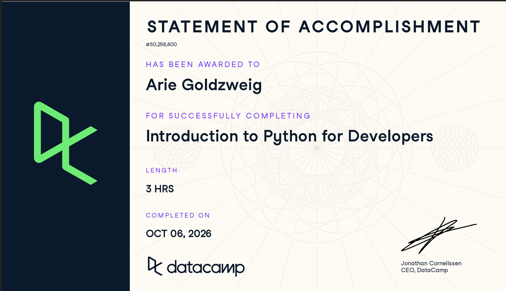

# Certificaciones de Python

Llena este archivo en **tu copia**, dentro de `estudiantes/<tu-login>/python/`.

## Quién soy

- Usuario de GitHub: goldzweigarie-bit
- Usuario de DataCamp: 

El repositorio es público: no escribas aquí tu nombre completo ni tu correo.

## Introduction to Python for Developers

Fecha en que lo terminaste (AAAA-MM-DD): 2026-10-06

URL del Statement of Accomplishment:https://www.datacamp.com/courses/ 

## Una cosa que aprendiste y no sabías

Se llena en esta entrega. Dos o tres líneas: algo concreto del curso que no
sabías, o que tenías a medias y ahí se te acomodó.

Si bien el curso cubría el contenido que ya habiamos visto en Gestión de Datos, me acordé que los diccionarios en Python son estructuras de datos que permiten almacenar información en parejas de clave y valor. Esto se me hizo interesante y busque las matemáticas detrás de ellos, lo que encontré fue que transforma la llave ("nombre") en un número entero único mediante una función hash interna

